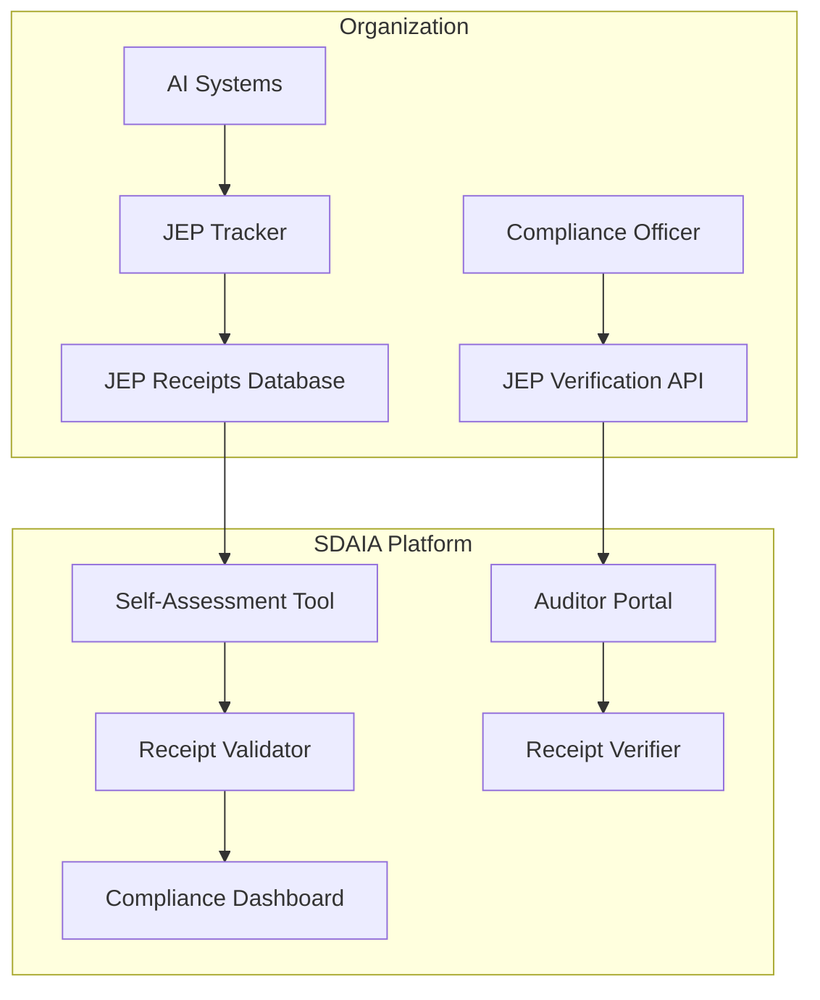

# SDAIA AI Service Provider Certification - Self-Assessment Tool Integration Guide

**JEP Implementation for Saudi Arabia**

[](https://sdaia.gov.sa)
[](https://jep.org)

---

## 📋 Document Overview

This guide provides step-by-step instructions for integrating JEP (Judgment Event Protocol) receipts with SDAIA's AI Service Provider Certification self-assessment tool. By following this guide, organizations can:

- Automate compliance evidence collection
- Generate verifiable certification packages
- Streamline SDAIA audit processes
- Maintain continuous compliance monitoring

---

## 🔗 1. Understanding SDAIA Certification Framework

### 1.1 Certification Overview

SDAIA offers optional registration for AI service providers who demonstrate compliance with Saudi AI frameworks. The certification process includes:

| Stage | Description | JEP Role |
|-------|-------------|----------|
| **Self-Assessment** | Organization evaluates own compliance | JEP receipts provide verifiable evidence |
| **Documentation Review** | SDAIA reviews compliance documentation | JEP event chain serves as immutable record |
| **Technical Audit** | SDAIA validates technical implementation | JEP verification API enables real-time validation |
| **Certification Issuance** | SDAIA grants certification | JEP receipt generated for certification |
| **Continuous Monitoring** | Ongoing compliance verification | JEP continuous monitoring feeds audit trail |

### 1.2 Certification Criteria

| Criteria | SDAIA Requirement | JEP Evidence |
|----------|-------------------|--------------|
| **Ethical Commitment** | Adherence to 7 Ethics Principles | JEP ethics compliance receipts |
| **Transparency** | AI decisions must be explainable | JEP decision factor records |
| **Accountability** | Clear responsibility allocation | JEP judge/delegate event chain |
| **Risk Management** | Risk assessments and mitigation | JEP risk classification receipts |
| **Data Governance** | PDPL compliance | JEP privacy receipts |
| **Human Oversight** | Meaningful human supervision | JEP human oversight receipts |

---

## 🛠️ 2. JEP-SDAIA Integration Architecture

### 2.1 High-Level Architecture



### 2.2 Integration Components

| Component | Purpose | Implementation |
|-----------|---------|----------------|
| **JEP Tracker** | Generate compliance receipts | `sa_tracker.py` |
| **Receipt Exporter** | Export receipts for SDAIA tool | JSON/CSV export module |
| **Verification API** | Enable SDAIA to verify receipts | REST API endpoint |
| **Continuous Monitor** | Ongoing compliance checks | Monitoring service |

---

## 📝 3. Step-by-Step Integration Guide

### 3.1 Prerequisites

```bash
# Install JEP Saudi Arabia package
pip install jep-sa

# Initialize compliance tracker
from jep_sa import SaudiAITracker

tracker = SaudiAITracker(
    organization="Your Organization",
    organization_id="YOUR-ID",
    sector="your-sector",
    jurisdiction="saudi"
)
```

### 3.2 Step 1: Generate Core Compliance Receipts

Create receipts for all required SDAIA frameworks:

```python
# Example: Generate ethics compliance receipts
ethics_receipt = tracker.register_ai_system({
    "system_name": "Your AI System",
    "accountability_mechanism": True,
    "transparency_provisions": True,
    "privacy_controls": True,
    "bias_mitigation": True,
    "human_oversight": True,
    "safety_tests": True,
    "social_impact_assessment": True
})

# Generate risk classification
risk_receipt = tracker.classify_ai_risk({
    "system_name": "Your AI System",
    "data_classification": "confidential",
    "decision_impact": "high",
    "risk_level": "high"
})

# Generate human oversight records
oversight_receipt = tracker._create_receipt(
    event_type="delegate",
    subject_id="human-oversight",
    payload={
        "action": "oversight_record",
        "approver": "Responsible Officer",
        "timestamp": "2026-03-09T10:00:00Z"
    }
)
```

### 3.3 Step 2: Export Receipts for SDAIA Tool

```python
import json
from datetime import datetime

class SDAIAExporter:
    """Export JEP receipts for SDAIA self-assessment tool"""
    
    def __init__(self, tracker):
        self.tracker = tracker
        self.export_format = "sdaia_v1"
    
    def export_certification_package(self) -> dict:
        """Generate complete certification package"""
        
        # Group receipts by framework
        packages = {
            "ethics_principles": self._filter_receipts("ai_ethics_principles"),
            "generative_ai": self._filter_receipts("generative_ai_guidelines"),
            "deepfakes": self._filter_receipts("deepfakes_guidelines"),
            "risk_management": self._filter_receipts("risk_management_framework"),
            "adoption": self._filter_receipts("ai_adoption_framework")
        }
        
        # Generate summary
        summary = {
            "organization": self.tracker.organization,
            "organization_id": self.tracker.organization_id,
            "sector": self.tracker.sector.value,
            "export_date": datetime.now().isoformat(),
            "total_receipts": len(self.tracker.receipts),
            "frameworks_covered": list(packages.keys()),
            "packages": packages
        }
        
        return summary
    
    def _filter_receipts(self, framework: str) -> list:
        """Filter receipts by framework"""
        return [
            {
                "receipt_id": r.receipt_id,
                "event_type": r.event_type,
                "timestamp": r.timestamp,
                "payload": r.payload
            }
            for r in self.tracker.receipts
            if r.payload.get('sdaia_framework') == framework
        ]
    
    def export_to_json(self, filename: str):
        """Export to JSON for SDAIA tool upload"""
        package = self.export_certification_package()
        with open(filename, 'w', encoding='utf-8') as f:
            json.dump(package, f, indent=2, default=str)
        print(f"✅ Exported to {filename}")
    
    def export_to_csv(self, filename: str):
        """Export to CSV for spreadsheet analysis"""
        import csv
        
        with open(filename, 'w', newline='', encoding='utf-8') as f:
            writer = csv.writer(f)
            writer.writerow(['Receipt ID', 'Event Type', 'Framework', 'Timestamp', 'Subject'])
            
            for r in self.tracker.receipts:
                writer.writerow([
                    r.receipt_id,
                    r.event_type,
                    r.payload.get('sdaia_framework', 'unknown'),
                    r.timestamp,
                    r.subject_id
                ])
        
        print(f"✅ Exported to {filename}")

# Usage
exporter = SDAIAExporter(tracker)
exporter.export_to_json("sdaia_certification_package.json")
exporter.export_to_csv("sdaia_receipts_audit.csv")
```

### 3.4 Step 3: Configure Verification API

Create a verification endpoint for SDAIA auditors:

```python
# verification_api.py
from flask import Flask, request, jsonify
from jep_sa import SaudiAITracker
import hashlib
import hmac

app = Flask(__name__)

# Load tracker with organization data
tracker = SaudiAITracker(
    organization="Your Organization",
    organization_id="YOUR-ID",
    sector="your-sector",
    jurisdiction="saudi"
)

@app.route('/api/verify/receipt/<receipt_id>', methods=['GET'])
def verify_receipt(receipt_id):
    """Verify a single receipt"""
    receipt = next((r for r in tracker.receipts if r.receipt_id == receipt_id), None)
    
    if not receipt:
        return jsonify({"error": "Receipt not found"}), 404
    
    # Verify signature (simplified)
    is_valid = receipt.verify(public_key="sdaia-audit-key")
    
    return jsonify({
        "receipt_id": receipt.receipt_id,
        "verified": is_valid,
        "timestamp": receipt.timestamp,
        "event_type": receipt.event_type,
        "subject": receipt.subject_id,
        "framework": receipt.payload.get('sdaia_framework'),
        "compliant": receipt.payload.get('compliant', True)
    })

@app.route('/api/verify/organization', methods=['POST'])
def verify_organization():
    """Verify all receipts for an organization"""
    data = request.json
    org_id = data.get('organization_id')
    
    if org_id != tracker.organization_id:
        return jsonify({"error": "Organization mismatch"}), 403
    
    # Generate verification report
    report = {
        "organization": tracker.organization,
        "organization_id": tracker.organization_id,
        "verification_date": datetime.now().isoformat(),
        "total_receipts": len(tracker.receipts),
        "verified_receipts": sum(1 for r in tracker.receipts if r.verify("sdaia-audit-key")),
        "frameworks": {}
    }
    
    # Group by framework
    for r in tracker.receipts:
        framework = r.payload.get('sdaia_framework', 'unknown')
        if framework not in report['frameworks']:
            report['frameworks'][framework] = {
                "total": 0,
                "verified": 0
            }
        report['frameworks'][framework]["total"] += 1
        if r.verify("sdaia-audit-key"):
            report['frameworks'][framework]["verified"] += 1
    
    return jsonify(report)

if __name__ == '__main__':
    app.run(host='0.0.0.0', port=5000, ssl_context='adhoc')
```

---

## 🔄 4. Continuous Compliance Monitoring

### 4.1 Automated Daily Checks

```python
# monitor.py
import schedule
import time
from datetime import datetime

class SDAIAMonitor:
    """Continuous compliance monitor for SDAIA requirements"""
    
    def __init__(self, tracker):
        self.tracker = tracker
        self.alerts = []
    
    def check_daily_compliance(self):
        """Run daily compliance checks"""
        print(f"\n📊 Running daily SDAIA compliance check - {datetime.now().isoformat()}")
        
        checks = {
            "receipt_generation": self._check_receipt_generation(),
            "risk_thresholds": self._check_risk_thresholds(),
            "human_oversight": self._check_human_oversight(),
            "incident_response": self._check_incident_response()
        }
        
        # Generate daily report
        report = {
            "date": datetime.now().isoformat(),
            "checks": checks,
            "alerts": self.alerts[-10:]  # Last 10 alerts
        }
        
        # Save report
        with open(f"daily_compliance_{datetime.now().strftime('%Y%m%d')}.json", 'w') as f:
            json.dump(report, f, indent=2)
        
        return report
    
    def _check_receipt_generation(self) -> dict:
        """Verify receipts are being generated"""
        today = datetime.now().date()
        today_receipts = [
            r for r in self.tracker.receipts 
            if datetime.fromisoformat(r.timestamp).date() == today
        ]
        
        status = "✅" if len(today_receipts) > 0 else "⚠️"
        if len(today_receipts) == 0:
            self.alerts.append({
                "timestamp": datetime.now().isoformat(),
                "level": "warning",
                "message": "No receipts generated today"
            })
        
        return {
            "status": status,
            "receipts_today": len(today_receipts),
            "total_receipts": len(self.tracker.receipts)
        }
    
    def _check_risk_thresholds(self) -> dict:
        """Verify risk scores within thresholds"""
        high_risk_systems = []
        
        for r in self.tracker.receipts:
            if r.payload.get('action') == 'risk_classification':
                if r.payload.get('risk_level') == 'high':
                    high_risk_systems.append(r.subject_id)
        
        if len(high_risk_systems) > 5:
            self.alerts.append({
                "timestamp": datetime.now().isoformat(),
                "level": "warning",
                "message": f"High number of high-risk systems: {len(high_risk_systems)}"
            })
        
        return {
            "high_risk_systems": len(high_risk_systems),
            "within_threshold": len(high_risk_systems) <= 5
        }
    
    def _check_human_oversight(self) -> dict:
        """Verify human oversight records"""
        oversight_receipts = [
            r for r in self.tracker.receipts 
            if r.event_type == 'delegate' and 'human_oversight' in str(r.payload)
        ]
        
        return {
            "oversight_events": len(oversight_receipts),
            "active": len(oversight_receipts) > 0
        }
    
    def _check_incident_response(self) -> dict:
        """Check incident response readiness"""
        incident_receipts = [
            r for r in self.tracker.receipts 
            if 'incident' in str(r.payload)
        ]
        
        resolved = [
            r for r in incident_receipts 
            if r.payload.get('status') == 'resolved'
        ]
        
        return {
            "total_incidents": len(incident_receipts),
            "resolved": len(resolved),
            "resolution_rate": len(resolved)/len(incident_receipts) if incident_receipts else 1.0
        }

# Schedule daily checks
monitor = SDAIAMonitor(tracker)
schedule.every().day.at("23:59").do(monitor.check_daily_compliance)

while True:
    schedule.run_pending()
    time.sleep(60)
```

---

## 📤 5. Uploading to SDAIA Self-Assessment Tool

### 5.1 Manual Upload Process

1. **Generate Certification Package**
   ```bash
   python -m jep_sa.export --format sdaia --output certification_package.json
   ```

2. **Access SDAIA Portal**
   - Navigate to: https://sdaia.gov.sa/ai-certification
   - Log in with your organization credentials
   - Select "AI Service Provider Certification"

3. **Upload Package**
   - Click "Upload Evidence Package"
   - Select your `certification_package.json`
   - Verify file integrity (checksum provided)

4. **Review Automated Validation**
   - SDAIA tool validates all JEP receipts
   - Receives instant compliance score
   - Identifies any gaps automatically

### 5.2 API Integration (Automated)

```python
# sdaia_api_client.py
import requests
from typing import Dict

class SDAIAClient:
    """Client for SDAIA certification API"""
    
    def __init__(self, api_key: str, org_id: str):
        self.base_url = "https://api.sdaia.gov.sa/certification/v1"
        self.api_key = api_key
        self.org_id = org_id
    
    def upload_certification_package(self, package: Dict) -> Dict:
        """Upload certification package to SDAIA"""
        
        headers = {
            "Authorization": f"Bearer {self.api_key}",
            "Content-Type": "application/json",
            "X-Organization-ID": self.org_id
        }
        
        response = requests.post(
            f"{self.base_url}/packages",
            json=package,
            headers=headers
        )
        
        if response.status_code == 201:
            return response.json()
        else:
            raise Exception(f"Upload failed: {response.text}")
    
    def check_verification_status(self, package_id: str) -> Dict:
        """Check verification status of uploaded package"""
        
        response = requests.get(
            f"{self.base_url}/packages/{package_id}/status",
            headers={"Authorization": f"Bearer {self.api_key}"}
        )
        
        return response.json()
    
    def get_certification_report(self) -> Dict:
        """Download current certification report"""
        
        response = requests.get(
            f"{self.base_url}/organizations/{self.org_id}/report",
            headers={"Authorization": f"Bearer {self.api_key}"}
        )
        
        return response.json()

# Usage
client = SDAIAClient(api_key="your-sdaia-api-key", org_id="YOUR-ID")
result = client.upload_certification_package(certification_package)
print(f"Package uploaded: {result['package_id']}")
```

---

## ✅ 6. Verification Checklist

Use this checklist to ensure successful integration:

### Pre-Upload Checklist

| Check | Status | Verification Method |
|-------|--------|---------------------|
| All 7 ethics principles covered | ⬜ | Run `verify-sa.py --ethics` |
| Generative AI guidelines met | ⬜ | Run `verify-sa.py --generative` |
| Deepfakes controls in place | ⬜ | Run `verify-sa.py --deepfakes` |
| Risk assessments completed | ⬜ | Run `verify-sa.py --risk` |
| Human oversight documented | ⬜ | Check delegate receipts |
| Receipts signed and valid | ⬜ | Run `verify-sa.py --signatures` |
| Export package generated | ⬜ | Check `certification_package.json` |

### SDAIA Validation Results

```python
# validation_results.py
expected_results = {
    "receipts_valid": 100,
    "frameworks_covered": 5,
    "compliance_score": 92,
    "certification_status": "approved",
    "valid_until": "2027-03-09",
    "audit_trail": "https://verify.jep.org/sa/audit/YOUR-ID"
}
```

---

## 🏆 7. Success Metrics

### Certification Benefits

| Metric | Expected Outcome |
|--------|------------------|
| **Compliance Score** | 90%+ in SDAIA assessment |
| **Audit Time** | Reduced from weeks to hours |
| **Market Access** | GCC region + 53 OIC countries |
| **Customer Trust** | Verified by government standard |
| **Competitive Edge** | Differentiated as "SDAIA Certified" |

---

## 🔍 8. Troubleshooting

### Common Issues and Solutions

| Issue | Symptom | Solution |
|-------|---------|----------|
| **Missing Receipts** | Framework shows incomplete | Run `generate_all_receipts.py` |
| **Signature Invalid** | Verification fails | Check private key configuration |
| **Export Format Error** | SDAIA tool rejects upload | Validate JSON schema |
| **Framework Gap** | Certain criteria not met | Review missing receipts |
| **API Connection** | Cannot reach SDAIA | Check network/firewall |

---

## 📞 9. Support Contacts

### SDAIA Certification Support

| Contact | Information |
|---------|-------------|
| **Email** | certification@sdaia.gov.sa |
| **Portal** | https://sdaia.gov.sa/ai-certification |
| **Phone** | +966 11 123 4567 |

### JEP Technical Support

| Contact | Information |
|---------|-------------|
| **Email** | signal@humanjudgment.org |
| **GitHub** | https://github.com/hjs-spec/jep-sa-solutions |
| **Documentation** | https://docs.jep.org/saudi |

---

## 🎉 10. Next Steps

1. **Generate Certification Package**
   ```bash
   python -m jep_sa.export --all --format sdaia
   ```

2. **Run Full Verification**
   ```bash
   python tests/verify-sa.py --org "Your Organization" --sector your-sector --report sdaia-audit.html
   ```

3. **Upload to SDAIA Portal**
   - Log in to SDAIA certification portal
   - Upload `sdaia_certification_package.json`
   - Await verification results (typically 5-7 business days)

4. **Display Certification**
   - Add SDAIA certification badge to your website
   - Include in RFPs and proposals
   - Leverage for GCC market expansion

---

*This guide is maintained by HJS Foundation for Saudi Arabia compliance. Last updated: March 2026*
